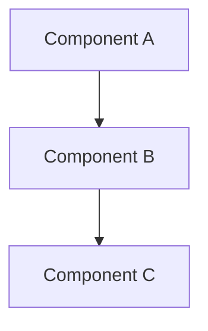
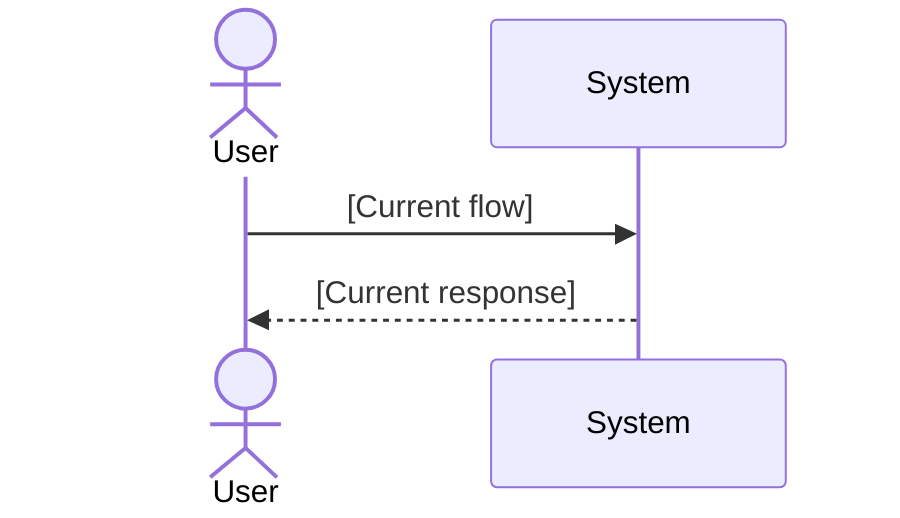
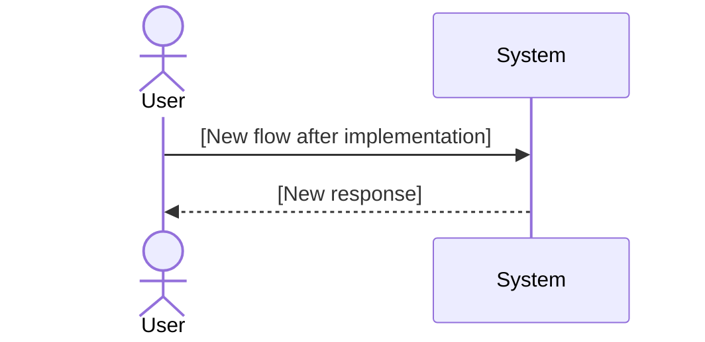

# Technical Analysis Template

Use this template when generating a per-repo technical analysis document. This template is tech-agnostic -- adapt sections based on what the codebase actually contains.

```markdown
# [Epic Name] — Technical Analysis: [Repo Name]
**JIRA Epic**: EPIC-XXX
**Repository**: [repo-name]
**Tech Stack**: [Auto-detected: e.g., Java/Spring Boot, Python/FastAPI, Angular, React, Go, etc.]

## Goal of the Task
[1-2 paragraph summary: what this Epic requires from THIS specific repo, and the business value.]

## Analysis Summary

**Modules/Packages Affected**:
- `module-or-package`: [Brief description of changes needed]

**Key Integration Points**:
- [Detected integration patterns: HTTP clients, message brokers, event streams, etc.]

**Interface Impacts**:
- [API contract changes, schema changes, event schema changes -- only what applies]

## Dependencies

### Team Dependencies
- **Team X**: [Coordination needs, or "None"]

### Service Dependencies
- **Service A → Service B**: [Nature, timing, or "None"]

### Technical Dependencies
- **New Libraries**: [Dependencies to add, or "None"]
- **Infrastructure**: [Cloud resources, queues, caches, or "None"]
- **Configuration**: [Environment variables, secrets, or "None"]

### Timeline Dependencies
1. [Phase 1: what must happen first]
2. [Phase 2: what depends on Phase 1]

## Architecture Overview
[Key architectural decisions and patterns detected in this repo.]



## Workflows

### Current State


### Future State


## Coding Guidelines Detected
- [Guidelines found in .github/instructions/, .editorconfig, linter configs]
- [Patterns to follow based on existing codebase conventions]

## Similar Implementations Found
- `path/to/similar/file.ext` — [How it's similar, what patterns to reuse]

## Risks
| Risk | Impact | Likelihood | Mitigation | Owner |
|------|--------|------------|------------|-------|
| [Risk 1] | High/Med/Low | High/Med/Low | [Strategy] | [Team] |
| [Risk 2] | High/Med/Low | High/Med/Low | [Strategy] | [Team] |

## Open Questions
- [Unresolved items from gap analysis or user responses]

## Assumptions
- [Explicit assumptions made during analysis]
```

## Adaptation Rules
- **Skip sections** that don't apply to the repo (e.g., skip "Workflows" for a library repo)
- **Add sections** if the repo has unique concerns (e.g., "Accessibility" for UI repos, "Data Migration" for DB-heavy repos)
- **Never assume** a framework -- detect from actual files
- **Always include** Mermaid diagrams for architecture and workflows where applicable
